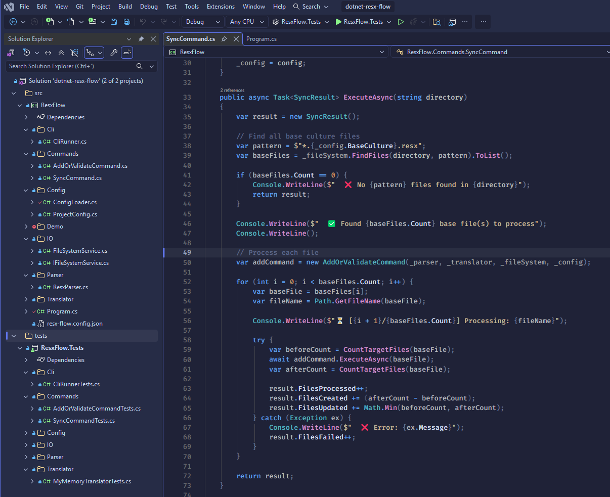

# Tales From 80s

A colorful, 80s-inspired dark theme for Visual Studio — deep blue-violet backgrounds, a cool electric-blue accent, and warm syntax highlights tuned for comfortable long coding sessions.

Based on the VS Code theme [one-monokai-80s](https://github.com/marcelo-mason/one-monokai-80s) by marcelo-mason.

## License

[MIT](./LICENSE) — based on One Monokai 80s by marcelo-mason.
